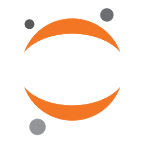

## Hi there 👋
# About Me 👋 

<code></code>

Hello! 😁 My Name is Catherine Paris. 

I'm a Global Affairs major at the University of Notre Dame. I have minors in 1) Computing and Digital Technology Studies, 2) Foundations of Business, 3) Gender Studies. I am set to graduate in May 2027. I am originally from Summit, New Jersey but actually live abroad in London now! In my free time, I enjoy scrapbooking, watching ice hockey (go rangers!), and spending time with my friends :)

- Current Projects:🌱 I’m currently learning Python through platforms like Google Colab and VS Code.
- Skills 💻: I'm comfortable working on data visualization projects and using libraries like Seaborn to create clear, informative visual representations of data.
<code></code>
<code></code>
<code></code>
<code></code>
- Goals 😄:  I'm looking forward to better understanding GitHub and all its features! 
- Fun fact: I've broken the same leg twice 🫣
- Contact Links: https://www.linkedin.com/in/catherine-paris/ 

<!--
**cath2705/cath2705** is a ✨ _special_ ✨ repository because its `README.md` (this file) appears on your GitHub profile.

Here are some ideas to get you started:

- 🔭 I’m currently working on ...
- 🌱 I’m currently learning ...
- 👯 I’m looking to collaborate on ...
- 🤔 I’m looking for help with ...
- 💬 Ask me about ...
- 📫 How to reach me: ...
- 😄 Pronouns: ...
- ⚡ Fun fact: ...
-->

<!--
**cath2705/cath2705** is a ✨ _special_ ✨ repository because its `README.md` (this file) appears on your GitHub profile.

Here are some ideas to get you started:

- 🔭 I’m currently working on ...
- 🌱 I’m currently learning ...
- 👯 I’m looking to collaborate on ...
- 🤔 I’m looking for help with ...
- 💬 Ask me about ...
- 📫 How to reach me: ...
- 😄 Pronouns: ...
- ⚡ Fun fact: ...
-->
